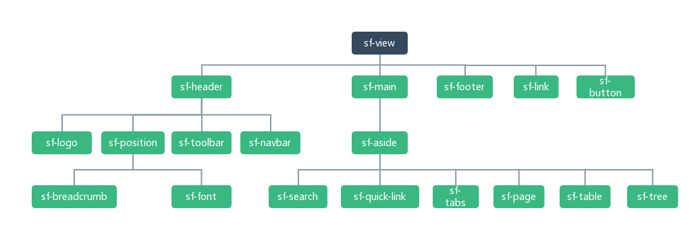

# 法律法规组件文档
基于 vue2.x 封装的法律法规系统组件，源码在[这里](https://github.com/gongph/sflds-vue)。

## 组件结构图

## 项目依赖
- jquery 1.9以上版本
- bootstrap(js/css)：该组件使用的是 v3.3.5 版本
- vue 2.0以上版本：该组件使用的是 vue 最新 v2.3.3 版本

## 目录

- [介绍](README.md)
- [组件]()
  - [布局]()
    - [sf-view](./view.md)
    - [sf-header](./header.md)
    - [sf-logo](./logo.md)
    - [sf-position](./position.md)
    - [sf-main](./main.md)
    - [sf-aside](./aside.md)
    - [sf-footer](./footer.md)
  - [功能]()
    - [sf-toolbar](./toolbar.md)
    - [sf-navbar](./navbar.md)
    - [sf-breadcrumb](./breadcrumb.md)
    - [sf-font](./font.md)
    - [sf-search](./search.md)
    - [sf-quick-link](./quick-link.md)
    - [sf-tabs](./tabs.md)
    - [sf-page](./page.md)
    - [sf-table](./table.md)
    - [sf-button](./button.md)
    - [sf-link](./link.md)
    - [sf-tree](./tree.md)