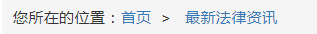

# 面包屑组件
面包屑组件是 [position](./position.html) 组件的子组件。

## 示例代码

```html 
<sf-breadcrumb>
  <sf-breadcrumb-item href="/home">首页</sf-breadcrumb-item>
  <sf-breadcrumb-item href="/zxflzx">
    <template>最新法律资讯</template>
    <template slot="separator"></template>
  </sf-breadcrumb-item>
</sf-breadcrumb>
```

## 效果图



## API
以下是 `<sf-breadcrumb>` 组件可用的 props：

| 属性 | 类型 | 默认值 | 说明 |
| :---: | :---: | :---: | --- |
| title | String | `您所在的位置：` | 标题 |
| separator | String | `>` | 分隔符 |

以下是 `<sf-breadcrumb-item>` 组件可用的 props ：

| 属性 | 类型 | 默认值 | 说明 |
| :---: | :---: | :---: | :--- |
| href | String | `-` | 跳转链接 |