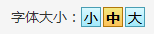

# 字体大小组件
字体大小组件主要是实现指定选择器中的内容字体的大小，它是 [position](./position.html) 组件的子组件。

## 示例代码

```html
<sf-font selector=".position_nav_l"></sf-font>
```

## 效果图



## API
以下是 `<sf-font>` 组件可用的 props：

| 属性 | 类型 | 默认值 | 说明 |
| :---: | :---: | :---: | :--- |
| selector | String | - | 指定要改变字体的选择器 |
| cache | Boolean | `false` | 是否开启缓存，开启后刷新页面不会恢复到默认字体 |
| small | String | `12px` | 设置小号字体大小 |
| middle | String | `16px` | 设置中号字体大小 |
| large | String | `20px` | 设置大号字体大小 |