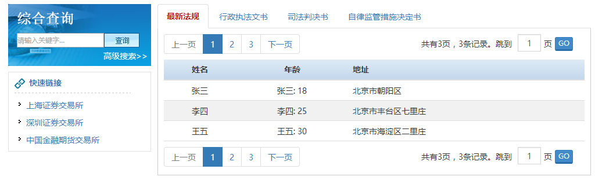

# 主体组件
主体组件是 [sf-view](./view.html) 组件的子组件。

## 示例代码

```html
 <sf-main>...</sf-main>
```

## 效果图



## API
以下是 `<sf-main>` 组件可用的 props：

| 属性 | 类型 | 默认值 | 说明 |
| :---: | :---: | :---: | :--- |
| classes | String | `page_middle` | 指定 `class` 样式 |