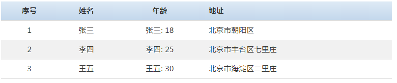

# 表格组件
表格组件用来进行数据展示，将非结构化数据通过 HTML表格的形式呈现到页面中。

## 示例代码

```html
<sf-table 
  :columns="columns" 
  :data="tableDatas" 
  :current="currentPage" 
  :page-size="1" 
  :show-page="true" 
  @on-page-change="onPageChange">
</sf-table>
```

```js
new Vue({
  ...
  data: {
    // 表格列
    columns: [
      { title: '姓名', key: 'name', width: '5%' },
      { title: '年龄', key: 'age', render: function (data, row) {
        return row.name + ': ' + data;
      }},
      { title: '地址', key: 'address', classes: 'text-left' }
    ],
    // 表格数据
    tableDatas: [
      { name: '张三', age: 18, address: '北京市朝阳区'},
      { name: '李四', age: 25, address: '北京市丰台区七里庄'},
      { name: '王五', age: 30, address: '北京市海淀区二里庄'}
    ],
    currentPage: 1 // 当前页 
  },
  methods: {
    onPageChange: function (pageInfo) {
      pageInfo.page // 当前页
      pageINfo.pageSize // 每页显示条数
    }
  }
});
```

## 效果图



## API

以下是 `<sf-table>` 组件可用的 props：

| 属性 | 类型 | 默认值 | 说明 |
| :--- | :---: | :---: | :--- |
| classes | String | `-` | 自定义 `class` 样式 |
| columns | Array | `[]` | 自定义表格列 |
| data | Array | `[]` | 服务端数据源 |
| show-page | Boolean | `true` | 是否显示分页 |
| current | Number | `1` | 当前页 |
| page-size | Number | `20` | 每页显示条数 |
| show-jump | Boolean | `true` | 是否显示分页，当 `show-page: true` 时生效 |

其中 `columns` 数组每个对象中完整的属性如下：

```js
...
columns: [
  {
     title  : '', // 标题
     key    : '', // 键，值对应数据源中的属性,
     width  : '', // 列宽度
     classes: '', // 自定义列样式
     render : function (data, row) {
       // data: 当前单元格中的值
       // row： 当前行对象
     }
  }
]
...
```

以下是 `<sf-search>` 组件可用的事件：

| 事件名 | 参数 | 参数类型 | 说明 |
| :--- | :---: | :---: | :--- |
| on-page-change | pageInfo | Object | 页码改变时触发，返回分页信息 |