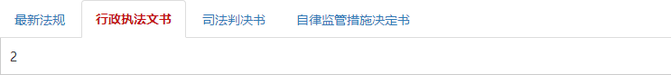

# 标签页组件
标签页是对 [boostrap](http://v3.bootcss.com/javascript/#tabs) 标签页插件的封装。

## 示例代码

```html
<sf-tabs @show:tab="onShowTab">
  <sf-tab id="t1" header="最新法规">1</sf-tab>
  <sf-tab id="t2" header="行政执法文书">2</sf-tab>
  <sf-tab id="t3" header="司法判决书">3</sf-tab>
  <sf-tab id="t4" header="自律监管措施决定书">4</sf-tab>
</sf-tabs>
```
```js
new Vue({
  ...
  methods: {
    onShowTab: function (event) {
      event.target        // 当前标签页
      event.relatedTarget // 前一个标签页
    }
  }
});
```

## 效果图



## API

以下是 `<sf-tabs>` 组件可用的 props：

| 属性 | 类型 | 默认值 | 说明 |
| :--- | :---: | :---: | :--- |
| active | Number | `0` | 激活指定的标签页，默认第一个 |

以下是 `<sf-tabs>` 组件可用的事件：

| 事件名 | 参数 | 参数类型 | 说明 |
| :--- | :---: | :---: | :--- |
| show:tab | event | Object | 标签显示前触发，其中 `event.target` 得到当前标签页<br> `event.relatedTarget` 得到前一个标签页 |
| shown:tab | event | Object | 标签显示后触发 |
| hide:tab | event | Object | 标签隐藏前触发 |
| hidden:tab | event | Object | 标签隐藏后触发 |

以下是 `<sf-tab>` 组件可用的 props：

| 属性 | 类型 | 默认值 | 说明 |
| :--- | :---: | :---: | :--- |
| id | String | `-` | 定义一个 `id` |
| header | String | `-` | 标签页头部标题 |
| disabled | Boolean | `false` | 是否禁用当前标签页 |