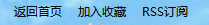

# 工具条组件
工具条组件包括：`返回首页` 、 `加入收藏` 、 `RSS订阅` ，是 [sf-header](./header.html) 组件的子组件。

## 示例代码

```html
<sf-toolbar>
  <sf-toolbar-item href="#" @click="backHome">返回首页</sf-toolbar-item>
  <sf-toolbar-item>加入收藏</sf-toolbar-item>
  <sf-toolbar-item>RSS订阅</sf-toolbar-item>
</sf-toolbar>
```

```js
new Vue ({
  ...
  methods: {
    backHome: function () {
      // 业务逻辑处理
    }
  }
});
```

## 效果图



## API

以下是 `<sf-toolbar-item>` 组件可用的 props：

| 属性 | 类型 | 默认值 | 说明 |
| :--- | :---: | :---: | :--- |
| href | String | `#` | 指定跳转链接 |
| target | String | `_blank` | 打开方式，用法同 `<a>` |

以下是 `<sf-toolbar-item>` 组件可用的事件：

| 事件名 | 参数 | 参数类型 | 说明 |
| :--- | :---: | :---: | :--- |
| click | event | Object | 点击触发 |