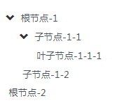

# 树形组件
树形组件将数据以树形的形式展示到页面上。

## 示例代码

```html 
<sf-tree :data="treeData" @on-select-change="onSelectChange"></sf-tree>
```


```js
new Vue({
  ...
  data: {
    treeData: [{
        title: '根节点-1',
        expand: true,
        children: [{
          title: '子节点-1-1',
          children: [{
            title: '叶子节点'
          }]
        }]
      }, {
        title: '根节点-2',
        children: [{
          title: '子节点-2-1',
          children: [{
            title: '叶子节点'
          }]
        }]
      }, {
        title: '根节点-3',
        children: [{
          title: '叶子节点'
        }]
    }]
  },
  methods: {
    onSelectChange: function (data) {
      // data: 当前节点对象
    }
  }
});
```

## 效果图



## API

以下是 `<sf-table>` 组件可用的 props：

| 属性 | 类型 | 默认值 | 说明 |
| :--- | :---: | :---: | :--- |
| data | Array | `[]` | 服务器数据源 |

其中 `data` 数组每个对象中完整的属性如下：

```js
...
data: [
  {
     title  : String, // 标题
     expand: Boolean, // 是否展开节点
     children: Array  // 子节点
  }
]
...
```

以下是 `<sf-tree>` 组件可用的事件：

| 事件名 | 参数 | 参数类型 | 说明 |
| :--- | :---: | :---: | :--- |
| on-select-change | data | Object | 当节点被选中的时候触发，返回当前节点对象 |